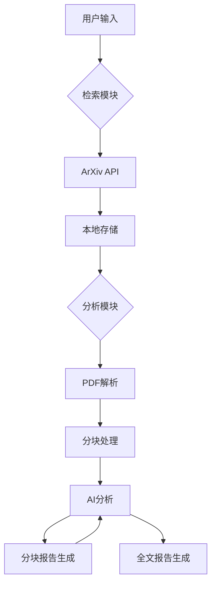

# ArXiv 论文智能分析工具

## 概述
本工具集由两个智能模块组成，提供从论文检索到深度分析的完整解决方案。基于ArXiv开放论文库和深度学习技术，帮助研究者快速定位前沿成果并进行结构化解析。

## 功能特性
- **智能检索模块** 🎯
  - 关键词驱动的精准论文搜索
  - 元数据与全文内容获取
  - 自动化的文献归档系统
  - 支持批量下载与本地缓存

- **深度分析模块** 🔍
  - PDF智能解析与文本分块
  - 多维度内容分析框架：
    - 核心观点提取
    - 技术术语双语对照
    - 实验数据识别
    - 研究局限性分析
  - 自适应文本分块处理
  - 分级摘要生成系统

## 快速开始

### 环境配置

#### 安装依赖库
```bash
pip install langchain requests pdfplumber python-dotenv nltk
```
#### 安装nltk分词器——(若网络不稳定，可以参考下面的替代方案)
```bash
python -c "import nltk; nltk.download('punkt')"
```
#### 安装nltk分词器替代方案

1. 在python环境下使用`from nltk.book import *`命令,在报错中找到应该安装的路径(诸如`E:/nltk_data`、`C:\nltk_data`等)，自己取定一个最合适的路径。

2. 进入本项目`./Other_EnvFile`目录，该目录下有一份已调试完成的`nltk_data`文件，将其复制放置于第一步中取定的一个对应路径(注意如果取定目标路径定在`E:/nltk_data`,应将`packages`包解压改名后直接放在`E`盘下)

3. 在cmd中执行`python -c "import nltk; from nltk.book import *"`命令，如果成功打印出TEXT1~9无报错，即环境配置成功


### 检索论文
```bash
python ./PaperCatcher.py --key "LLM" --n 5 --name cv_papers
```
参数说明：
- `--key`: 搜索关键词（默认："TTA"）
- `--n`: 返回论文数量（默认：10）
- `--name`: 输出目录名称（默认："default"）

输出结构：
```
/res/
  └─ [目录名]/
      ├─ YYYY-MM-DD-Title_1.txt
      ├─ YYYY-MM-DD-Title_2.txt
      ├─ ……
      └─ YYYY-MM-DD-Title_n.txt
```

### 分析论文
```bash
python PaperProcessor.py --path ./res/cv_papers
```
输出结构：
```
/result/
  └─ [目录名]/
    └─ [part]/
      └─ analysis_report_part.md
    └─ [sum]/
      └─ analysis_report_sum.md
```

## 技术架构


## 配置说明
1. 修改`init.py`文件中的`API_KEY`为有效密钥,`API_URL`为所调用模型API地址，`MODEL_ID`为所调用模型ID

2. 可根据需要调整解析参数：
   ```python
   # 系统路径配置
   self.PDF_DIR = "./pdfs"  # PDF 文件保存目录
   self.RESULT_DIR = "./result"  # 分析结果保存目录
   self.SEARCH_DIR = "./res"  # 论文检索结果保存目录
   self.Path = "./default"   #输入目录默认路径（包含论文链接文件）
   
   # 网络请求配置
   
   self.MAX_RETRIES = 10  # 最大重试次数
   self.BACKOFF_FACTOR = 2  # 重试时的时间回退系数
   
   # PDF 解析配置
   self.MAX_PDF_PAGES = 10  # 提取文本的最大页数
   self.CHUNK_SIZE = 10000  # 文本分块长度
   ```

## 可能的输出示例
```markdown
# 论文分析报告

## 原文信息
- 地址: [https://arxiv.org/abs/2103.00001](https://arxiv.org/abs/2103.00001)

## 分块分析
### 片段 1
【核心观点】提出新型对比损失函数... 
【关键技术】InfoNCE loss, 温度系数τ
【实验数据】ImageNet top-1 acc 提升2.1%
...

## 最终汇总
### 核心贡献
提出基于信息最大化的对比学习框架...
```

## 注意事项
1. API调用限制：目前默认模型只支持RPM=1000，TPM=50000
2. 建议单次检索不超过300篇论文
3. PDF解析支持英文论文效果最佳
4. 完整文本获取需遵守ArXiv使用条款

## 许可协议
本工具基于 MIT 协议开源，欢迎贡献代码与改进建议。学术用途请遵守相关论文的引用规范。
