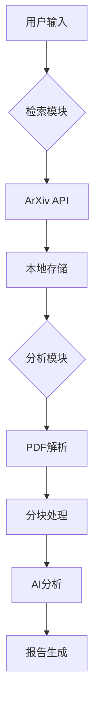

# ArXiv 论文智能分析工具

## 概述
本工具集由两个智能模块组成，提供从论文检索到深度分析的完整解决方案。基于ArXiv开放论文库和深度学习技术，帮助研究者快速定位前沿成果并进行结构化解析。

## 功能特性
- **智能检索模块** 🎯
  - 关键词驱动的精准论文搜索
  - 元数据与全文内容获取
  - 自动化的文献归档系统
  - 支持批量下载与本地缓存

- **深度分析模块** 🔍
  - PDF智能解析与文本分块
  - 多维度内容分析框架：
    - 核心观点提取
    - 技术术语双语对照
    - 实验数据识别
    - 研究局限性分析
  - 自适应文本分块处理
  - 分级摘要生成系统

## 快速开始

### 环境配置
```bash
# 安装依赖库
pip install langchain requests pdfplumber python-dotenv
```

### 检索论文
```bash
python arxiv_retriever.py --key "对比学习" --n 5 --name cv_papers
```
参数说明：
- `--key`: 搜索关键词（默认："TTA"）
- `--n`: 返回论文数量（默认：10）
- `--name`: 输出目录名称（默认："default"）

输出结构：
```
/res/
  └─ [目录名]/
      ├─ YYYY-MM-DD-Title_1.txt
      └─ YYYY-MM-DD-Title_n.txt
```

### 分析论文
```bash
python paper_analyzer.py --path ./res/cv_papers
```
输出结构：
```
/result/
  └─ [目录名]/
      ├─ analysis_report_1.md
      └─ analysis_report_n.md
```

## 技术架构


## 配置说明
1. 修改`.env`文件中的`API_KEY`为有效密钥
2. 调整解析参数：
   ```python
   # paper_analyzer.py
   MAX_PDF_PAGES = 10    # 解析页数限制
   CHUNK_SIZE = 10000    # 文本分块长度
   MAX_RETRIES = 5       # 请求重试次数
   ```

## 典型输出示例
```markdown
# 论文分析报告

## 原文信息
- 地址: [https://arxiv.org/abs/2103.00001](https://arxiv.org/abs/2103.00001)

## 分块分析
### 片段 1
【核心观点】提出新型对比损失函数... 
【关键技术】InfoNCE loss, 温度系数τ
【实验数据】ImageNet top-1 acc 提升2.1%
...

## 最终汇总
### 核心贡献
提出基于信息最大化的对比学习框架...
```

## 注意事项
1. API调用限制：每日1000次请求
2. 建议单次检索不超过20篇论文
3. PDF解析支持英文论文效果最佳
4. 完整文本获取需遵守ArXiv使用条款

## 许可协议
本工具基于 MIT 协议开源，欢迎贡献代码与改进建议。学术用途请遵守相关论文的引用规范。